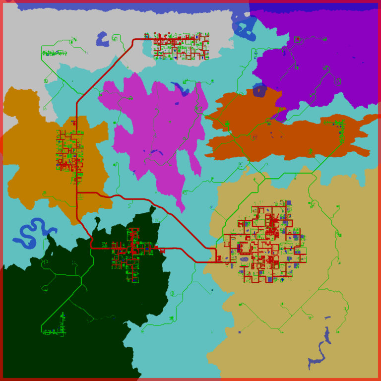
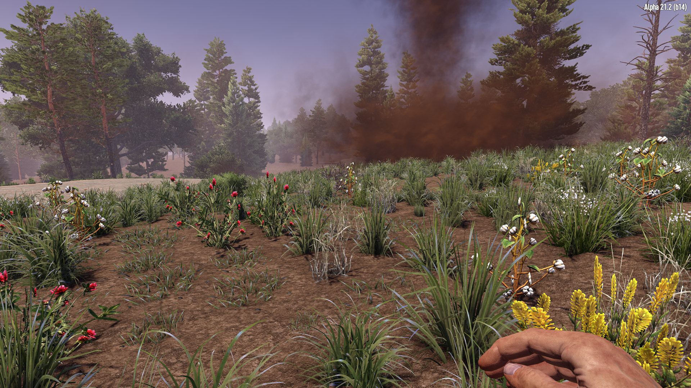
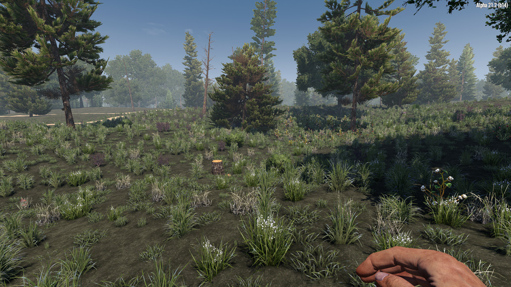
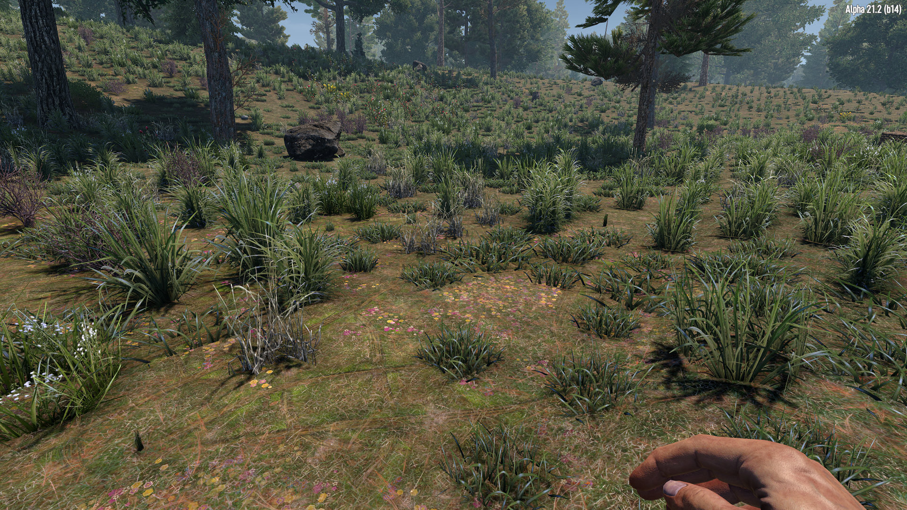

# OCB MicroSplat Test World Biomes Mod - Demo for OCB MicroSplat

Custom Biomes and World Demo Mod for [OcbMicroSplat][1].

This mod includes a custom map, named "Test Biomes", that consists
of 8 different biomes. The 5 vanilla biomes and 3 new custom ones.
I made no effort to customize biome foliage (plants, trees etc).

You need to disable EAC to use this mod!

End-users should download [OcbMicroSplat from Nexusmods][3].

## In-Game Screenshots

## Changelog

### Version 0.3.1

- Add ids to biome spawns for V1.2 compatibility

### Version 0.3.0

- Add two other biomes back to map
- Add enemy spawning to new biomes
- Adjust biome foliage a little

### Version 0.2.1

- Fix missing resource bundle

### Version 0.2.0

- First compatibility with V1.0 (exp)
- Bumped unity version to 2022.3.29f1

### Version 0.1.0

- Initial version

## Compatibility

Developed initially for a21.1(b6), updated through a21.2(b14).

[1]: https://github.com/OCB7D2D/OcbMicroSplat
[2]: https://github.com/OCB7D2D/OcbMicroSplat/releases
[3]: https://www.nexusmods.com/7daystodie/mods/2873